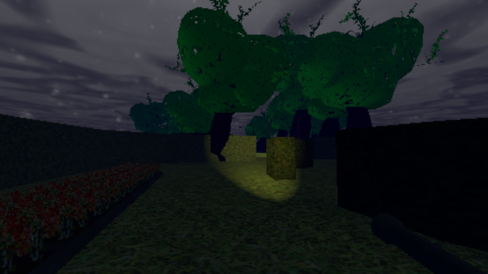

# ☁️ HazyRoad

A short puzzle game with a dark atmosphere, made with [Godot Engine](https://godotengine.org/).

## About

You're on your way home and come to a crossroads where a barrier is blocking your way. You decide to get out of your car to find a way through.

### Controls

- `WASD` to move.
- `Mouse` to move the camera around.
- `Shift` to sprint.
- `Space` to jump.
- `ESC` to open and close settings menu.

### Screenshots

   

## Contributing

We welcome community contributions to this project.

Please read our [Contributor Guide](CONTRIBUTING.md) for more information on how to get started.
